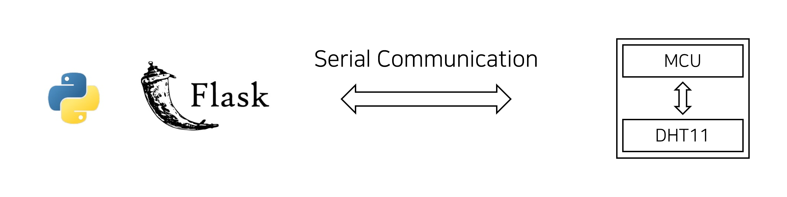

# dht11-web-monitor
flask web application for dht11(temperature and humidity) sensor monitoring

## Structure

## Protocol

| byte |        description      | 
|:----:|:-----------------------:|
|  0   | start flag(0x02)        |
|  1   | humidity(integer)       |
|  2   | humidity(fractional)    |
|  3   | temperature(integer)    |
|  4   | temperature(fractional) |
|  5   | end flag(0x03)          |